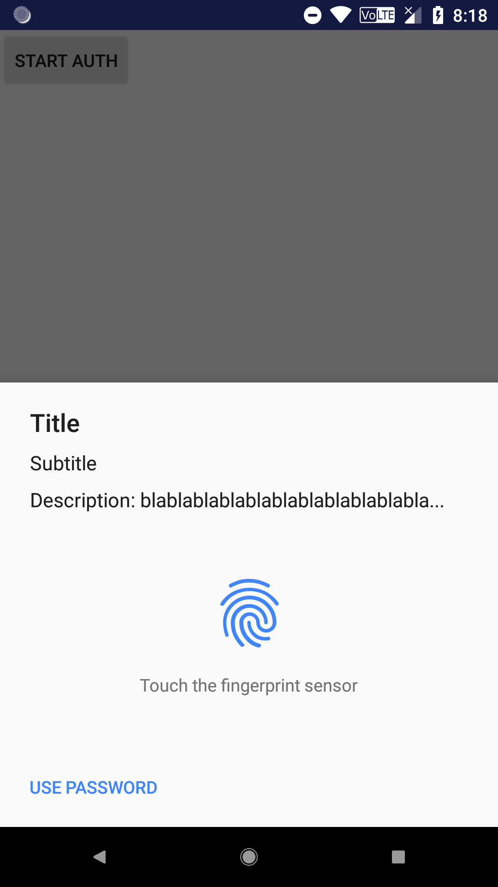
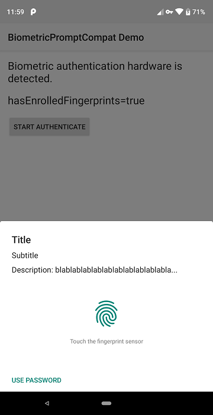

BiometricPromptCompat
====

> In Android P, Google provides a easier way for developers to use biometric sensors to authenticate user identity: **BiometricPrompt**. However, it is only supported in latest Android. We create a compat library to take it to All Android 6.0+ devices.

## Introduction

#### What is `BiometricPrompt`?

It looks like mostly a new `FingerprintManager` which is added in Android 6.0 (M). Its literal meaning may be: not only *fingerprints* will be supported, but also other biometric sensors.

So if we use this API, it's easy to support other biometric sensors for authenticating, such as face identity.

To learn more, read [BiometricPrompt Reference](https://developer.android.com/reference/android/hardware/biometrics/BiometricPrompt) in Android Developers site.

#### How to use it in old devices?

BiometricPromptCompat is designed to make it compatible in old Android. Its interface is very close to the original `BiometricPrompt` in order that we can keep a consistent UI in different Android.

Of course, in Android P or newer version, we will use original `BiometricPrompt` API. Then we cannot guarantee the UI is completely consistent in diffrent devices. Because ROM manufacturers will redesign in their own styles.

And we should realize that **in Android M there is only fingerprint sensor to be supported.** I am sorry that I have no plan to adapt thousands of ROMs' incompatible APIs.

## Requirements

- Platform SDK for Android P Preview (`android-p`)
- Android Studio 3.1+

## Samples

We recommend to learn `FingerprintManager` or `BiometricPromptCompat` before using this library. All you need to know will be found.

```java
final BiometricPromptCompat biometricPrompt = new BiometricPromptCompat.Builder(context)
        .setTitle("Title")
        .setSubtitle("Subtitle")
        .setDescription("Description: blablablablablablablablablablabla...")
        .setNegativeButton("Use password", new DialogInterface.OnClickListener() {
            @Override
            public void onClick(DialogInterface dialog, int which) {
                Toast.makeText(
                    context,
                    "You requested password.",
                    Toast.LENGTH_LONG).show();
            }
        })
        .build();

biometricPrompt.authenticate(cancellationSignal, myCallback);
```

## Test & Screenshots

Tested successfully in Android 8.1 & P Preview.

### Android 8.1



### Android P Preview



## Contact author

Telegram: [@fython](https://t.me/fython)

## License

Apache License 2.0